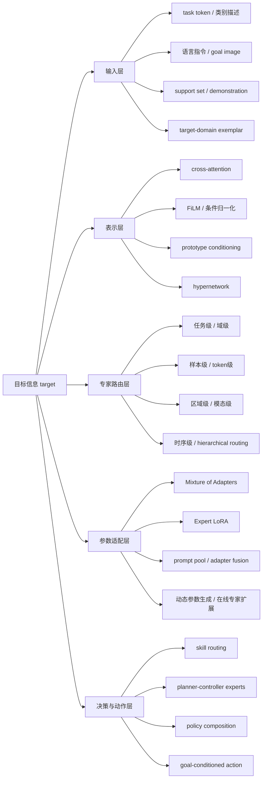
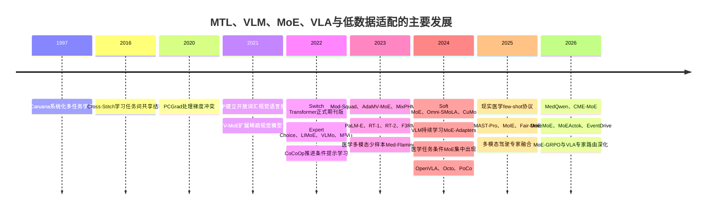
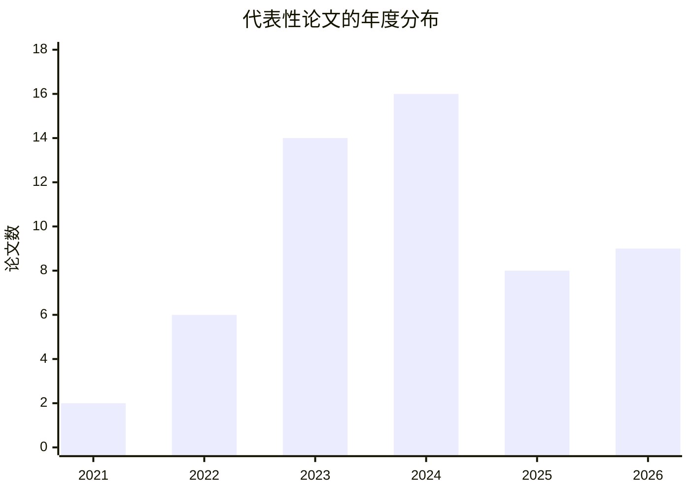

# 面向目标感知专家混合与少样本适配的多任务、视觉语言及视觉语言动作研究地图

## 执行摘要与范围假设

本报告以用户附件中已经明确的研究任务为准：系统梳理多任务学习（MTL）、视觉语言模型（VLM）、视觉语言动作模型（VLA）、目标感知专家混合（target-aware MoE）与少样本适配在通用视觉、医学影像、自动驾驶和机器人／具身智能中的交叉关系；本轮只建立研究地图、审查证据边界，不提出模型结构、创新点或论文方案。fileciteturn0file0

原始请求曾将研究主题视为“未指定”。在读取附件前，合理的候选主题包括：

| 领域 | 候选主题 | 选择理由 |
|---|---|---|
| 技术 | target-aware MoE 与 few-shot adaptation 在 VLM/VLA 中的结合 | 同时涉及基础模型、条件计算、低成本适配和开放任务泛化，适用面最广 |
| 健康 | 医学视觉语言模型在小样本、跨医院和跨设备条件下的可靠适配 | 临床样本稀缺、域偏移和灾难性遗忘问题突出，现实约束清晰 |
| 政策 | 模块化基础模型的审计、责任边界与部署治理 | 专家动态选择使模型行为、责任归属和安全验证更复杂 |

由于附件已经指定第一个方向，本报告不再自行更换主题。未指定参数按如下方式处理：受众假定为准备选题或审稿的机器学习研究人员；语言为中文；检索截止时间为 **2026 年 8 月 4 日**；无地域和预算限制；篇幅采取“分析优先、证据表压缩呈现”；日文二手资料不作为核心证据，核心来源为英文原始论文和官方 proceedings。

**核心结论如下。**

第一，“target-aware MoE”尚不是边界稳定的学术术语。严格意义上的目标感知方法，必须让任务、目标域、类别描述、查询、提示、行为目标、支持集或语言指令直接影响专家选择、专家组合或参数生成。大量被称为“task-aware”或“multimodal MoE”的方法，实际上只是固定 task ID 路由，或普通 token/input-dependent sparse MoE，不能等同于开放世界的目标条件化路由。

第二，五个方向解决的问题不同。MTL主要缓解任务间重复建模并促进共享；VLM提供视觉与语言的语义对齐及零样本接口；VLA把视觉和语言条件进一步映射为动作；MoE通过条件激活增加容量或分隔任务干扰；few-shot adaptation则在少量下游数据下改变提示、适配器、低秩参数、原型或上下文。它们的交叉并不天然成立：一个模型可以同时拥有多个任务、多种模态和多个专家，却仍然没有目标感知路由，也没有真正的少样本适配。

第三，当前最常见的组合不是“由支持集推断新任务并组合专家”，而是以下三类较弱组合：已知任务标签选择固定专家；输入 token 经 top-k router 选择专家；每个任务训练一个 adapter/LoRA，再由规则或文本描述选择适配器。[跨论文综合判断] 真正让 few-shot support set 同时定义目标、驱动路由、支持未见任务且无需重训 router 的正式论文极少。

第四，专家机制的真实贡献经常难以从规模效应中分离。V-MoE表明稀疏视觉模型可以在较低激活计算下扩展到约 150 亿参数；LIMoE证明语言—图像联合稀疏专家可以获得强零样本性能；但这些结果不意味着专家学到了可迁移、可解释的任务技能。专家使用率、路由热图或负载均衡指标只能证明分配差异，不能单独证明因果上的技能专门化。citeturn15view11turn15view12turn3search1

第五，医学影像对“目标感知+低数据适配”提供了最密集的实验场景，但也暴露出最明显的协议问题。MICCAI 2025 的现实少样本评估表明，在类别不平衡、没有平衡验证集的条件下，一些通常的医学 VLM 适配方法甚至可能低于零样本基线。MAST-Pro等方法报告了参数效率和 Dice 提升，但官方评审同时指出路由描述、数据划分、推理成本和可复现性信息不足。citeturn15view10turn15view2

第六，自动驾驶和机器人中的“目标”更接近动作语义。DriveMoE在视觉端按场景选择摄像头信息、在动作端按驾驶技能选择专家，并使用闭环 Bench2Drive 评估；MoEActok则把动作片段聚类成技能并采用技能专家量化。两者比仅做视觉问答的驾驶 VLM 更接近 VLA，但仍未证明可以从极少数新技能示例中安全地生成、插入和在线验证新专家。citeturn16search4turn16search2

第七，在本报告的 **58 篇结构化代表论文**中，54 篇为正式主会／会议论文，3 篇为正式期刊论文，1 篇为 workshop proceedings；未把 arXiv-only 工作与正式论文等同。严格同时满足“显式目标条件化、真实专家机制、明确 few-shot support/adaptation”的论文仅约 **2 篇**；若将 LoRA、adapter、持续适配和测试时适配纳入广义低数据适配，则约为 **9 篇**。[本调研推断] 这说明该交叉区域并非已经拥挤成熟，而是名称繁多、机制重合度高、强证据稀少。

## 概念边界、研究问题与检索方法

**多任务学习。** MTL旨在由多个相关任务共同训练共享表示。硬参数共享使用共同 backbone 与任务头；软参数共享保留任务网络并交换特征或约束参数；Cross-Stitch一类方法学习任务流之间的线性组合；PCGrad、GradDrop、FAMO等方法则处理梯度冲突或任务损失失衡。Caruana的经典定义强调利用任务间归纳偏置改善泛化，而后续研究表明，共享并不必然有益，任务梯度可能相互抵消或使某些任务长期欠优化。citeturn2search0turn2search1turn2search5turn17search3turn17search8

**视觉语言模型。** VLM通过图文对比、融合编码、生成式预训练或指令微调，使自然语言成为类别、查询、任务或知识接口。CLIP奠定了大规模图文对比和零样本分类路线；VLMo、LIMoE、OmniVL、IMP等工作分别探索模块化专家、稀疏多模态专家或通用感知模型。citeturn12search1turn4search0turn15view12turn3search7

**视觉语言动作模型。** VLA不仅输出文字或类别，还输出机器人关节命令、动作 token、轨迹或驾驶控制。RT-1把机器人任务统一成 token 序列；RT-2将互联网视觉语言知识迁移至机器人动作；OpenVLA以 7B 开源模型和约 97 万条机器人示范构建通用策略，并支持 LoRA 适配；Octo由约 80 万条、九种平台的轨迹训练，可用数小时下游数据微调。citeturn9search1turn9search8turn15view13turn15view14

**专家混合。** MoE由多个专家、路由器和组合规则构成。稠密 MoE对全部专家加权；稀疏 MoE仅激活 top-k 专家；token-choice由 token 选择专家；expert-choice由专家选择 token；Soft MoE以连续分派替代离散容量约束；Switch Transformer简化为 top-1 路由，并明确指出稀疏模型仍受到通信成本、训练不稳定和负载失衡制约。citeturn17search0turn3search1turn3search13turn15view11

**少样本适配。** 本报告不把“数据集较小”自动视为 few-shot。纳入标准要求论文明确限制每类样本或下游示例数量，或以低数据支持集完成提示学习、原型构建、参数更新、上下文学习或任务推断。CoCoOp、RPO、ProGrad和SuS-X代表 CLIP 的提示、正则化或缓存／外部知识适配；Med-Flamingo代表医学多模态上下文学习；F3RM代表少样本语言引导机器人操作。citeturn12search0turn1search0turn1search4turn1search8turn1search6turn1search9

**目标感知 MoE 的操作化分类如下。**

| 类别 | 判定标准 | 是否算作严格 target-aware MoE |
|---|---|---:|
| 显式目标条件化专家 | router或组合器直接读取任务描述、目标图像、类别文本、目标域样本、语言指令、行为目标或支持集 | 是 |
| 固定 task-ID 路由 | 已知有限任务集合，每个 task ID 对应固定或学习路由 | 部分；不支持开放任务时单独标记 |
| 普通输入依赖 sparse MoE | router仅读取当前 token/feature，不知道外部目标是什么 | 否 |
| 多头、多分支、多解码器 | 不存在竞争、稀疏选择或专家组合 | 否 |
| adapter/LoRA/prompt pool | 参数模块可选择或组合，但未必是传统 MoE | 邻近方法 |
| 多损失“伪多任务” | 仅相加多个损失，没有实质共享、路由或交互机制 | 否 |

Target进入模型的阶段被编码为五层：输入层的任务 token、目标提示和支持集；表示层的 cross-attention、FiLM、条件归一化和原型调制；路由层的任务／样本／token／区域／模态／时序专家选择；参数层的 adapter、LoRA、prompt pool、超网络或动态参数生成；决策层的技能路由、策略组合、规划器—控制器分工和目标条件动作生成。

**检索方法。** 本轮采用四层策略：先追溯MTL、梯度冲突、稀疏MoE、CLIP、提示适配和机器人通用策略的奠基论文；再分别检索CVF Open Access、NeurIPS proceedings、OpenReview、PMLR、MICCAI Open Access／Springer、RSS proceedings、IEEE和正式期刊页面；随后按“MTL×MoE”“VLM×MoE”“MoE×PEFT”“goal-conditioned experts×policy”“medical VLM×few-shot”等组合交叉检索；最后检查作者后续版本、会议版本与期刊扩展。综述只用于发现术语，核心结论均尽可能回溯至原始论文或官方录用页面。

纳入时记录：论文状态；任务和领域；输入输出；target定义；target注入位置；路由与专家粒度；训练和冻结策略；few-shot用途；数据集和指标；是否支持未见任务／域；消融、公平 dense baseline、已知限制和证据强度。由于会议间训练数据、模型规模、预训练和指标差异很大，本报告不把不同论文的绝对分数直接排列为统一排行榜。

## 研究地图与发展时间线

**输入层目标感知**的优势是语义明确，可以直接使用任务文本、类别描述或示范；弱点是容易依赖模板措辞和已知任务描述。CoCoOp根据图像条件生成提示；PODA用目标域文本提示进行零样本域适配；MoIRA比较任务指令与专家文本描述，从外部选择VLA专家。citeturn12search0turn1search5turn14search8

**表示层目标感知**通常比直接硬路由平滑。例如VLM的跨注意力可以让文本查询选择区域特征，医学分割可把解剖提示与文本提示注入视觉表示。但这类条件调制如果没有竞争性专家分配，不应被称为MoE。

**路由层目标感知**是本报告的核心。Mod-Squad、MAST-Pro和DriveMoE分别使用任务、肿瘤类型／提示或驾驶场景／技能信息调节专家；LIMoE、V-MoE和Soft MoE主要是输入或token依赖路由，虽具有专门化潜力，但不属于严格的外部目标条件化。citeturn7search8turn15view2turn16search4turn15view12turn15view11turn3search13

**参数适配层**是few-shot与MoE最常见的交点。MixPHM把多种低参数模块进行混合；MoE-Adapters在持续VLM学习中隔离和组合适配器；MedQwen以频谱划分的LoRA专家进行路由；MoIRA把不同机器人技能存储为可独立替换的LoRA专家。citeturn7search6turn0search0turn16search0turn14search8

**决策层目标感知**在VLA中最关键。PoCo组合多个扩散策略；DriveMoE区分场景感知专家和驾驶技能专家；MoEActok按动作技能构建量化专家。这些方法解决的是动作多模态、技能冲突或策略组合问题，而不是传统视觉分类的专家容量扩展。citeturn9search2turn16search4turn16search2

这条时间线反映出两个阶段性变化：2021—2022年主要关注“用稀疏专家扩大容量和多模态预训练”；2023年以后重点逐渐转向任务隔离、低成本适配、持续学习和动作技能分解。citeturn15view11turn15view12turn0search0turn16search0turn16search4

## 代表性论文证据总表

以下共纳入 **58 篇**。为控制表宽，作者记为第一作者“等”；“T”表示外部target，“ID”表示固定任务标签，“X”表示普通输入依赖；“FS”表示严格few-shot，“PEFT”表示参数高效适配，“CL/TTA”表示持续／测试时适配。完整作者、页码和正式链接可由每行官方引用进入。

**奠基性、多任务与通用视觉／VLM**

| 论文、年份与状态 | 实际任务与输入输出 | target、路由及专家 | 训练／few-shot | 证据边界与相关性 |
|---|---|---|---|---|
| Caruana等，*Multitask Learning*，1997，Machine Learning期刊 citeturn2search0 | 多任务监督学习 | 无MoE；硬共享 | full training | [论文明确说明] 奠定MTL；不解决动态路由 |
| Misra等，*Cross-Stitch Networks*，CVPR 2016 citeturn2search1 | 分类、检测等任务共享 | 学习跨任务特征线性组合；非MoE | full training | 软共享奠基；依赖固定任务集合 |
| Yu等，*Gradient Surgery for Multi-Task Learning*，NeurIPS 2020 citeturn2search5 | 多任务优化 | 无专家；投影冲突梯度 | full training | 解决梯度干扰，不解决表示或路由 |
| Fedus等，*Switch Transformers*，JMLR 2022 citeturn17search0 | 大规模稀疏Transformer | X；token级top-1专家 | 预训练 | [实验直接支持] 扩展效率；通信和不稳定仍显著 |
| Riquelme等，*Scaling Vision with Sparse Mixture of Experts*，NeurIPS 2021 citeturn15view11 | 图像分类 | X；patch/token top-k | 大规模预训练 | 约150亿参数和强ImageNet结果；非外部target-aware |
| Zhou等，*Mixture-of-Experts with Expert Choice Routing*，NeurIPS 2022 citeturn3search1 | 通用MoE路由 | X；专家选择token | 预训练 | 改善负载控制；不推断任务语义 |
| Li等，*M³ViT*，NeurIPS 2022 citeturn3search6 | 多任务视觉Transformer | task/feature路由；稀疏任务专家 | 多任务联合训练 | 报告大幅FLOPs与能效改善；任务集合固定 |
| Radford等，*CLIP*，ICML 2021 citeturn12search1 | 图文对比、零样本分类 | 类别文本是目标接口；无MoE | 大规模预训练 | VLM与开放词汇基础；few-shot需外部适配 |
| Mustafa等，*LIMoE*，NeurIPS 2022 citeturn15view12 | 图文对比学习 | 模态/输入token路由 | 预训练 | [实验直接支持] 强零样本；语言token易产生负载不平衡 |
| Bao等，*VLMo*，NeurIPS 2022 citeturn4search0 | 视觉、语言、跨模态任务 | 模态专家；模态级组合 | 预训练+微调 | 目标是模态而非未见任务 |
| Zhou等，*Conditional Prompt Learning for Vision-Language Models*，CVPR 2022 citeturn12search0 | CLIP少样本泛化 | T=当前图像；条件提示生成 | FS prompt tuning | 非MoE，但奠定实例条件适配 |
| Lee等，*RPO*，ICCV 2023 citeturn1search0 | CLIP few-shot分类 | 类别／样本提示 | FS prompt optimization | 无专家；说明提示更新可能损伤预训练知识 |
| Zhu等，*ProGrad*，ICCV 2023 citeturn1search4 | 少样本提示学习 | target=下游类别 | FS；梯度约束 | 无MoE；关注基础知识保持 |
| Udandarao等，*SuS-X*，ICCV 2023 citeturn1search8 | 无训练或少样本CLIP适配 | 类别与外部支持图像 | cache／外部知识 | support用于分类器，不用于专家路由 |
| Fahes等，*PODA*，ICCV 2023 citeturn1search5 | 零样本目标域适配 | T=目标域文本提示 | prompt-driven adaptation | 无目标域图像；非MoE |
| Ye等，*Mod-Squad*，CVPR 2023 citeturn7search8 | 多任务视觉语言学习 | ID/T=任务；任务路由专家 | 联合训练 | 真正任务感知，但依赖已知任务集合 |
| Chen等，*AdaMV-MoE*，ICCV 2023 citeturn7search10 | 多视图视觉识别 | T=视图／样本状态 | 动态视图专家 | 样本条件化强；few-shot不是核心 |
| Zhang等，*MixPHM*，CVPR 2023 citeturn7search6 | 低资源VLM适配 | 多个低参数专家／适配器组合 | FS/PEFT | 与目标方向接近；开放任务路由证据有限 |
| Akbari等，*IMP*，NeurIPS 2023 citeturn3search7 | 图像、文本、音频通用感知 | 模态和任务条件组合 | 多任务预训练 | 支持多模态任务；不是few-shot router |
| Puigcerver等，*From Sparse to Soft Mixtures of Experts*，ICLR 2024 citeturn3search13 | 通用视觉MoE | X；soft token-slot分派 | 预训练 | 消除硬容量限制；无显式目标语义 |
| Mustafa等，*Omni-SMoLA*，CVPR 2024 citeturn4search15 | 多任务、多模态模型 | 模态／任务相关软低秩专家 | 多任务PEFT式训练 | 跨模态共享强；未见任务能力依赖基础模型 |
| Kanakis等，*MLoRE*，CVPR 2024 citeturn0search6 | 多任务密集视觉预测 | ID/feature；低秩专家路由 | 联合训练 | 提高共享与特化；固定任务 |
| Liu等，*TC-MoA*，CVPR 2024 citeturn7search12 | 多任务视觉适配 | task-conditioned mixture of adapters | PEFT | 明确任务条件；依赖已知task ID |
| Yu等，*MoE-Adapters for Continual Learning in VLMs*，CVPR 2024 citeturn0search0 | VLM持续学习 | 任务／输入选择适配器专家 | CL/PEFT | 报告较低训练参数；任务推断与遗忘仍耦合 |
| Li等，*CuMo*，NeurIPS 2024 citeturn0search1 | 多模态大模型扩展 | X/模态；视觉和语言MoE | 大规模预训练 | 性能与容量扩展相关；few-shot非核心 |
| Shen等，*Mixture of Multimodal Experts*，NeurIPS 2024 citeturn0search3 | 通用多模态LLM | 模态／token专家 | 预训练与指令微调 | 目标为模态和输入，不等于任务目标 |
| Qiu等，*μMoE*，NeurIPS 2024 citeturn0search7 | 高效细粒度专家参数化 | X；参数共享微型专家 | 预训练 | 容量效率路线；外部target缺失 |
| Ko等，*MoE-GRPO*，CVPR 2026 citeturn16search14 | 图像／视频VLM | 模态引导+RL探索专家组合 | RL后训练 | 缓解确定性top-k专家过拟合；无few-shot任务适配 |
| Li等，*CME-MoE*，CVPR 2026 citeturn16search1 | few-shot混合增量学习 | T=当前增量任务／域结构；条件复用和元扩展 | 严格FS/CL | 与目标方向高度相关；不是VLM/VLA |

**医学图像与医学VLM**

| 论文、年份与状态 | 实际任务 | target、路由及专家 | 训练／few-shot | 证据边界与相关性 |
|---|---|---|---|---|
| Moor等，*Med-Flamingo*，ML4H/PMLR 2023 citeturn1search6 | 医学图文问答与生成 | T=图文示范上下文 | in-context few-shot | 无MoE；示范进入语言上下文 |
| Jiang等，*M4oE*，MICCAI 2024 citeturn5search0 | 多任务、多模态医学影像 | 模态／任务专家 | 联合预训练 | 报告参数与性能优势；官方评审对基础模型定位和基线公平性有质疑 |
| Zhang等，*SAM-Med3D-MoE*，MICCAI 2024 citeturn5search1 | 多器官3D分割 | 解剖／输入特征专家 | 参数高效或模块训练 | Dice提升较明确；未见医院泛化不足 |
| Chen等，*Low-Rank Mixture-of-Experts for Continual Medical Image Segmentation*，MICCAI 2024 citeturn15view3 | 持续医学分割 | 任务语义／CLIP信息路由低秩专家 | CL/PEFT | 接近目标方向；仍依赖任务序列设定 |
| MICCAI 2024，*Task-Conditional MoE for Missing MRI Modalities* citeturn5search4 | 缺失模态MRI分割 | T=可用模态组合；任务级路由 | 联合训练 | 真正模态条件化；组合数扩展是瓶颈 |
| Liu等，*Fair-MoE*，MICCAI 2025 citeturn6search1 | 医学公平学习 | T=群体属性／样本 | 群体条件专家 | 解决群体差异；隐私和属性可用性是假设 |
| Zhang等，*BiomedCoOp*，CVPR 2025 citeturn12search5 | 生物医学CLIP少样本分类 | 类别文本和生物医学上下文 | FS prompt tuning | 非MoE；医学领域few-shot强基线 |
| MICCAI 2025，*Few-Shot, Now for Real* citeturn15view10 | 现实不平衡医学few-shot评估 | T=下游疾病分类 | FS；无平衡验证集 | [实验直接支持] 多种方法可低于zero-shot；关键协议论文 |
| MICCAI 2025，*Sequence-Independent Continual TTA with Mixture of Incremental Experts* citeturn15view7 | 跨域持续测试时分割 | T=在线推断的域偏移；新增专家 | TTA/CL | 可扩展专家；域边界与错误累积仍难 |
| Meng等，*MAST-Pro*，MICCAI 2025 citeturn15view2 | 泛肿瘤分割 | T=肿瘤类型、文本和解剖提示；通用／特异专家 | PEFT | 报告最高约+5.2 Dice、训练参数减91.04%；路由与数据划分审查有争议 |
| MICCAI 2025，*TextMoE* citeturn6search13 | 半监督医学分割 | T=文本类别／语义 | 文本条件专家 | 标注效率高；文本质量和已知类别依赖明显 |
| Nejatimanzari等，*Sparse Spectral LoRA: Routed Experts for Medical VLMs*，CVPR 2026 citeturn16search0 | VQA、报告、分类、幻觉抑制 | 输入／任务数据分布路由频谱LoRA专家 | PEFT/CL | 23个数据集；339倍更少可训练参数、遗忘约5%；显式语言target较弱 |
| CVPR 2026，*SegMoTE* citeturn8search4 | 医学分割 | 任务／组织类型专家 | 多任务训练 | 专家化分割；开放目标和few-shot证据有限 |
| Shao等，*Depth Any Endoscopy*，CVPR 2026 citeturn16search8 | 内窥镜单目深度 | T=手术域／内窥镜类型；内部LoRA/adapter MoE+外部域专家 | 自监督PEFT | 零样本与域内评估强；域标签和外部专家维护成本较高 |
| MICCAI 2025，*PATE* citeturn6search4 | 病理few-shot适配 | T=类别和支持集 | FS prompt/adapter | support直接适配分类；非严格MoE |

**自动驾驶**

| 论文、年份与状态 | 实际任务 | target、路由及专家 | 训练／few-shot | 证据边界与相关性 |
|---|---|---|---|---|
| CVPR Workshop 2023，*WEDGE* citeturn7search4 | 驾驶域泛化 | 天气／地理域条件 | 域适配 | workshop，证据权重低于主会 |
| Dewangan等，*BEV-InMLLM / NuInstruct*，CVPR 2024 citeturn7search14 | BEV视觉语言理解 | T=驾驶问题／指令 | 指令微调 | 主要输出文本与感知答案，不是闭环VLA |
| CVPR 2025，*Multi-Modal Expert Fusion* citeturn7search7 | 传感器失效鲁棒融合 | T=可用传感器和故障状态 | 多模态专家融合 | 解决缺失传感器；不等于行为目标条件化 |
| Yang等，*DriveMoE*，CVPR 2026 citeturn16search4 | 闭环端到端驾驶VLA | 场景选择视觉专家；技能选择动作专家；token/trajectory级 | 联合训练 | Bench2Drive闭环证据较强；没有few-shot新技能适配 |
| CVPR 2026，*EventDrive* citeturn7search3 | 事件相机／多模态驾驶 | 模态和场景路由 | 联合训练 | 实时模态适应相关；部署延迟与硬件证据有限 |

**机器人、具身智能与VLA**

| 论文、年份与状态 | 实际任务 | target、路由及专家 | 训练／few-shot | 证据边界与相关性 |
|---|---|---|---|---|
| Brohan等，*RT-1*，RSS 2023 citeturn9search1 | 多任务机器人操作 | T=语言指令；动作token生成 | 大规模示范训练 | VLA奠基；无显式专家 |
| Driess等，*PaLM-E*，ICML 2023 citeturn10search15 | 具身推理和机器人规划 | T=语言任务；视觉状态注入LLM | 多任务训练 | 跨任务语义能力强；动作控制并非统一MoE |
| Brohan等，*RT-2*，CoRL 2023 citeturn9search8 | 视觉语言知识到动作 | T=自然语言指令 | VLM+机器人联合微调 | 在数千次机器人试验中验证知识迁移；few-shot新任务仍依赖预训练语义 |
| Shen等，*F3RM*，CoRL 2023 citeturn1search9 | 少样本语言引导操作 | T=语言查询和少量示范 | 严格FS | 非MoE；支持集用于3D语义表示和策略学习 |
| Kim等，*OpenVLA*，CoRL 2024 citeturn15view13 | 通用机器人操作 | 语言指令条件动作 | 全量预训练+LoRA适配 | 约97万示范、7B模型；非专家路由 |
| Mees等，*Octo*，RSS 2024 citeturn15view14 | 跨机器人通用策略 | 任务文本／目标图像 | 少量下游微调 | 约80万轨迹、9平台；任务适配依赖数据兼容性 |
| Yang等，*PoCo*，RSS 2024 citeturn9search2 | 机器人策略组合 | T=任务约束／多策略目标 | 组合预训练扩散策略 | 属于policy composition邻近路线；非经典MoE |
| Kuzmenko等，*MoIRA*，Neurocomputing 2026 citeturn14search8 | 多任务VLA专家编排 | T=任务指令与专家文本描述；外部零样本路由 | LoRA专家，可独立增删 | 高度相关；路由依赖文本元描述和已有专家 |
| Xu等，*MoEActok*，CVPR 2026 citeturn16search2 | VLA动作离散化 | T=动作技能簇；技能专家量化器 | 联合训练 | 模拟和3个现实任务零样本迁移；新技能few-shot添加未验证 |

**论文表的综合判读。** [跨论文综合判断] 近三年最明显的变化不是“MoE全面替代dense模型”，而是专家单元从完整FFN逐渐细化为低秩矩阵、adapter、动作量化器、策略模块或外部模型；router输入也从纯token特征扩展到任务文本、模态状态、域属性和技能标签。与此同时，大多数论文仍假设目标类型可以在训练时枚举，或专家集合已经覆盖测试任务。

## 方法效用、关键假设与量化趋势

本报告的58篇代表论文中，2023—2026年论文共47篇，占约81%；2024年数量最多。统计是对本报告纳入表的人工编码，不代表整个学术数据库的绝对发表量。

| 统计维度 | 数量 |
|---|---:|
| 正式主会／会议论文 | 54 |
| 正式期刊论文 | 3 |
| workshop proceedings | 1 |
| arXiv-only纳入核心表 | 0 |
| CVPR | 19 |
| NeurIPS | 10 |
| MICCAI | 10 |
| ICCV | 5 |
| RSS / CoRL | 各3 |
| ICML | 2 |
| 其他正式载体 | 6 |
| 通用MTL／MoE基础 | 9 |
| 通用视觉与VLM | 20 |
| 医学影像 | 15 |
| 自动驾驶 | 5 |
| 机器人／VLA | 9 |

按可重叠标签编码，约39篇含真实MoE或竞争性模块路由，约30篇涉及VLM／多模态语义，约17篇涉及MTL，约10篇输出动作或策略，约21篇涉及few-shot、PEFT、持续或测试时适配。严格的“显式target-aware MoE + few-shot”仅约2篇；放宽到PEFT、持续适配和在线专家扩展后约9篇。[本调研推断]

**不同机制的横向比较如下。**

| 机制路线 | router输入 | 粒度 | few-shot信息用途 | 未见任务潜力 | 主要假设与风险 |
|---|---|---|---|---|---|
| 固定task-ID专家 | 已知task ID | 任务级 | 为每任务训练专家 | 低 | 任务集合封闭；新增任务通常需新专家和重训 |
| 输入依赖sparse MoE | token／视觉特征 | token或样本级 | 通常不使用support set | 中等但不可控 | 路由可能利用表面统计而非任务语义 |
| 文本／目标条件MoE | 指令、类别描述、goal | 任务或样本级 | 可作为router上下文 | 较高 | 对提示措辞、语义编码和专家描述敏感 |
| 域／模态条件专家 | 域标签、传感器状态 | 域或模态级 | 少量目标域数据估计域 | 中等 | 假定域可识别且边界稳定 |
| Mixture of Adapters／LoRA | task token、输入或规则 | 层级／任务级 | 更新少量专家参数 | 中高 | 基础模型冻结限制可塑性；专家数量持续增长 |
| 原型／支持集条件组合 | support prototype | 类别／任务级 | 直接计算路由权重 | 理论较高 | 原型在极少样本和域偏移下方差大 |
| 超网络／动态参数生成 | 任务描述或support embedding | 层／参数级 | 生成新参数 | 较高 | 参数生成稳定性和可验证性困难 |
| 技能路由／策略组合 | 语言目标、状态、技能标签 | 时序／轨迹级 | 微调策略或技能适配器 | 中等 | 错误路由会直接转化为动作风险 |

**各类方法实际解决的问题。**

MTL共享模型解决的是重复参数和跨任务知识利用，但共享越强，越容易发生负迁移。梯度方法只处理优化方向，不保证任务表示在语义上分离。PCGrad等工作说明冲突梯度可被投影修正，但这种修正不等同于学习专家专门化。citeturn2search5turn17search3turn17search8

稀疏MoE主要解决容量与激活计算解耦。V-MoE在视觉模型中证明可以增加总参数而只激活一部分；Switch报告相同资源下的预训练速度提升，但也明确记录通信复杂度和训练不稳定；Expert Choice则改进每个专家接收token数量的控制。citeturn15view11turn17search0turn3search1

多模态MoE主要解决不同模态的统计差异和容量竞争。LIMoE需要专门的熵与负载约束来防止语言token被少量专家垄断；VLMo和Omni-SMoLA在视觉、语言和跨模态模块之间进行不同程度的共享。[跨论文综合判断] 这些方法证明“模态专门化”有用，但尚不能证明专家能根据自然语言任务描述泛化到任意新任务。citeturn15view12turn4search0turn4search15

少样本提示和PEFT解决的是全量微调成本及小数据过拟合。CoCoOp使提示依赖输入，ProGrad约束提示更新不偏离预训练知识，MixPHM和MedQwen则把少量可训练参数进一步拆为多个专家。其关键风险是：参数少不等于数据需求低，论文若使用大量预训练、外部知识或验证集，不能仅凭“可训练参数少”称为few-shot。citeturn12search0turn1search4turn7search6turn16search0

医学MoE主要解决器官、疾病、模态、医院或任务间异质性。SAM-Med3D-MoE报告平均Dice从约53.2提高到56.4，并在困难数据集上有更大提升；MAST-Pro报告训练参数减少约91.04%和最高约5.2 Dice提升；MedQwen在23个医学数据集上报告比full fine-tuning少339倍可训练参数，并将顺序学习遗忘降至约5%，而部分基线下降超过20%—50%。这些数字来自各论文自身实验，不能直接横向比较。citeturn5search1turn15view2turn16search0

VLA中的专家机制解决动作分布的多峰性、长任务的技能分解或多平台差异。DriveMoE指出单一动作头容易产生轨迹“平均化”，因此使用技能动作专家；MoEActok将轨迹片段聚成技能簇后分别量化；PoCo直接组合已有策略。这些方法比视觉分类MoE更接近真实行为目标，但路由错误的代价也更高。citeturn16search4turn16search2turn9search2

**普遍关键假设包括：**

| 假设 | 影响 |
|---|---|
| 任务、域或技能可以在训练时枚举 | 未见任务到来时，旧router可能没有有效输出 |
| task ID、域标签或语言描述准确可用 | 实际部署中的目标往往模糊、冲突或缺失 |
| 专家数量可以随任务增长 | 存储、版本管理、显存和维护成本持续上升 |
| 基础模型已经覆盖目标语义 | PEFT无法补回基础模型完全没有学到的能力 |
| 少样本支持集独立且无泄漏 | 与预训练数据、模板或类别重叠会夸大泛化 |
| 路由额外成本可忽略 | 分布式all-to-all通信和adapter切换可能抵消稀疏计算收益 |
| 平衡专家使用等同于好路由 | 自然任务分布本来可能高度不平衡 |
| 离线指标能代表实际行为 | 医疗Dice、驾驶开环误差或机器人离线MSE未必代表部署安全 |

## 同质化设计、失败模式与最接近的十篇论文

**高度同质化设计。**

| 重复设计模板 | 代表性证据 | 为什么不宜单独作为核心创新 | 仍可能有价值的条件 |
|---|---|---|---|
| 共享backbone加多个任务头 | Cross-Stitch、MLoRE citeturn2search1turn0search6 | 已是MTL标准范式 | 新临床任务、部署约束或系统级验证充分 |
| 直接把dense FFN替换为top-k MoE | V-MoE、CuMo citeturn15view11turn0search1 | 容量扩展模板已成熟 | 有等FLOPs、等参数、延迟和通信完整评估 |
| task token输入MLP router | Mod-Squad、TC-MoA citeturn7search8turn7search12 | 固定任务条件路由已大量使用 | task token来自未见任务语义而非ID，并有严格隔离测试 |
| top-k gating加负载均衡损失 | Switch、LIMoE citeturn17search0turn15view12 | 属于基础训练组件 | 证明新的失衡机制或部署约束，而非仅调系数 |
| 每个任务一个adapter或LoRA | MixPHM、MoIRA citeturn7search6turn14search8 | 参数隔离模式高度常见 | 有大规模专家生命周期、热切换或真实在线运维证据 |
| prompt决定专家选择 | MAST-Pro、MoIRA citeturn15view2turn14search8 | 文本条件router本身不新 | 证明对措辞、目标冲突、未见组合和错误提示鲁棒 |
| 冻结基础模型只训练router | 多种adapter-MoE | 难区分收益来自router还是基础模型 | 与全量、单adapter、随机router及等参数dense公平对比 |
| 将现有MoE移植到医学分割 | SAM-Med3D-MoE、SegMoTE citeturn5search1turn8search4 | 应用迁移本身机制新颖性弱 | 多中心临床验证、缺失模态或现实标签成本构成独立贡献 |
| 只改变专家数、top-k和均衡系数 | 路由器比较研究 citeturn3search1turn3search13 | 属于超参数消融 | 可形成高质量系统研究或可复现benchmark |
| support均值／prototype加权专家 | few-shot原型路线 | 机制已高度标准化 | 在不平衡、噪声标签和跨域support下有新的实证结论 |
| 多个已有模块机械组合 | 若干prompt+MoE+PEFT系统 | 无法确定哪个模块产生收益 | 完整因子消融、等算力基线和真实约束可构成工程贡献 |

“结构同质化”不等于研究问题已解决。共享backbone、top-k路由和LoRA专家本身已经常见，但如何在未知目标、持续任务、极少样本和安全关键场景中可靠选择专家，仍缺少统一证据。

**技术矛盾和失败模式。**

| 类型 | 问题 | 当前证据 |
|---|---|---|
| 多篇重复观察 | 专家坍缩、负载不均和少数专家垄断 | Switch、LIMoE、Expert Choice等均需要容量或平衡机制 citeturn17search0turn15view12turn3search1 |
| 多篇重复观察 | 专家专门化与跨任务共享冲突 | 任务隔离减少负迁移，却会削弱低资源任务共享 |
| 多篇重复观察 | 负载均衡与任务最优分配冲突 | 均匀分配是系统目标，不必然是任务损失最优 |
| 多篇重复观察 | few-shot可塑性与稳定性冲突 | CME-MoE明确把少样本增量学习表述为稳定—可塑性难题 citeturn16search1 |
| 多篇重复观察 | 持续适配导致灾难性遗忘 | MoE-Adapters、MedQwen和医学持续分割均以此为主要问题 citeturn0search0turn16search0turn15view3 |
| 多篇重复观察 | 医院、扫描协议和人群域偏移 | 医学域条件和测试时适配论文普遍假定存在可检测分布变化 |
| 协议问题 | 平衡support和验证集夸大few-shot效果 | 现实医学评估发现部分方法低于zero-shot citeturn15view10 |
| 协议问题 | 等参数dense baseline不充分 | 总参数、激活参数、训练token、预训练数据和通信成本经常未同时匹配 |
| 协议问题 | 专家热图不证明技能因果性 | 需要专家交换、屏蔽、反事实路由等实验；多数论文仅报告使用率 |
| 单篇局部限制 | MAST-Pro的数据划分、路由细节和推理效率 | 官方评审记录了重叠风险、消融和延迟报告不足；作者作出澄清但部分争议仍在 citeturn15view2 |
| 单篇局部限制 | MoIRA依赖文本元描述 | 视觉环境可能已改变，但外部router只根据任务和专家文本选择 |
| 自动驾驶特有 | 开环提升不等于闭环安全 | DriveMoE使用闭环Bench2Drive，证据强于仅做QA或开环轨迹误差的工作 citeturn16search4turn7search14 |
| VLA特有 | 静态语义理解不等于长时序控制 | RT-2、OpenVLA、Octo仍受示范覆盖、错误恢复和动作精度限制 citeturn9search8turn15view13turn15view14 |
| 尚缺系统实验 | router能否由support set识别完全未见任务 | 现有多数评估只留出类别、指令措辞或同一任务族实例 |
| 尚缺系统实验 | 新增专家后是否无需重训router | 外部文本路由较有潜力，但缺少大规模动态专家库验证 |
| 无法下结论 | 提升来自专家还是规模和额外数据 | 许多MoE模型总参数、预训练规模和数据源同时增加 |
| 无法下结论 | 开放世界与组合泛化 | benchmark通常没有严格隔离预训练技能、对象和语言模板 |

**与“target-aware MoE + few-shot adaptation”最接近的十篇论文。** 排序依据为：显式target条件化、真实专家选择、低数据／PEFT、未见任务潜力、VLM/VLA相关性和证据质量的综合，而非标题关键词重合。

| 排名 | 论文 | target如何影响专家／参数 | few-shot或适配方式 | 未见任务与实质差异 |
|---:|---|---|---|---|
| 1 | **MoIRA** citeturn14search8 | 任务指令与专家文本描述进入外部router，选择独立VLA LoRA专家 | 专家以LoRA训练；router可零样本，也可使用提示示例 | [论文明确说明] 专家可独立增加和替换，不必重训内部MoE；[差异] support set通常不直接生成或更新专家，且视觉状态不参与外部路由 |
| 2 | **CME-MoE** citeturn16search1 | 当前增量任务和潜在域结构控制专家复用与元扩展 | 明确few-shot增量训练 | [实验直接支持] 在5个数据集、3类few-shot增量设定中有效；[差异] 不属于VLM/VLA，target主要由增量阶段和特征分布表示 |
| 3 | **MedQwen / Sparse Spectral LoRA** citeturn16search0 | 输入和任务分布影响频谱LoRA专家路由 | PEFT与顺序适配 | 支持跨数据集持续学习；[差异] target不是自然语言任务或support-defined目标，严格few-shot未成为核心协议 |
| 4 | **MAST-Pro** citeturn15view2 | 肿瘤类型、文本提示和解剖提示影响通用／特异低秩专家选择 | PEFT，只更新少量参数 | 可跨肿瘤数据集；[差异] 任务、器官、模态和肿瘤类型通常预先已知，且不从少量support自动推断 |
| 5 | **Low-Rank MoE for Continual Medical Segmentation** citeturn15view3 | 任务语义或视觉语言表示辅助选择低秩专家 | 持续PEFT | 关注新分割任务和遗忘；[差异] 任务顺序和任务身份较明确，未证明开放指令任务 |
| 6 | **MoE-Adapters for Continual VLMs** citeturn0search0 | 输入／任务决定适配器专家调用 | 冻结大部分基础模型，持续训练adapter | 能缓解旧任务遗忘；[差异] few-shot support未直接训练通用router，新增任务仍需适配阶段 |
| 7 | **MixPHM** citeturn7search6 | 多个轻量适配模块通过学习权重组合 | 明确面向低资源VLM适配 | 少样本性能与参数效率较相关；[差异] target-aware程度弱于指令条件专家，组合器对未见任务泛化证据有限 |
| 8 | **MoIE持续测试时医学适配** citeturn15view7 | 在线分布变化触发或选择增量专家 | 无标签TTA、专家扩展 | 不需要明确task ID的潜力较高；[差异] target是隐式域偏移，不是显式语义目标，错误域检测可能持续累积 |
| 9 | **DriveMoE** citeturn16search4 | 场景信息选择视觉专家，驾驶技能选择动作专家 | 联合大规模训练，无严格few-shot | 支持多场景闭环驾驶；[差异] 新场景／技能不能仅凭少量示例插入专家，router通常需随系统训练 |
| 10 | **MoEActok** citeturn16search2 | 动作片段聚类形成技能标识，技能上下文选择量化专家 | 非few-shot；动作tokenizer联合训练 | 有零样本现实任务迁移；[差异] 专家专门化由预定义聚类产生，不是由新目标描述或支持集在线组合 |

[跨论文综合判断] 排名前两篇分别覆盖了该方向的两端：MoIRA最接近“语言目标→可替换VLA专家”，CME-MoE最接近“few-shot任务不确定性→条件专家扩展”。尚未出现一篇正式论文同时充分实现：由少量多模态示例定义任意新目标、无需task ID推断路由、组合或新增VLM/VLA专家、在线适配且不遗忘，并在真实安全关键环境中验证。

## 完整性审查、行动建议与参考文献

**检索完整性审查。**

检索和核验来源包括CVF Open Access、NeurIPS Proceedings、OpenReview、PMLR、MICCAI Society Open Access与Springer proceedings、RSS在线论文集、JMLR、Machine Learning、Neurocomputing、IEEE相关页面及作者正式项目页。核心证据没有依赖博客、媒体报道、GitHub README或Semantic Scholar摘要。

关键词并非只使用“target-aware MoE”，而是覆盖target-conditioned、task-aware、task-conditioned routing、domain-aware experts、class-aware experts、query-conditioned routing、prompt-conditioned experts、instance-aware routing、modality routing、goal-conditioned MoE、dynamic routing、adaptive expert selection、mixture of adapters、expert LoRA、prompt pool、skill routing、policy composition、test-time adaptation和continual expert expansion。

命名最不统一的区域包括：mixture of adapters是否自称MoE；模块化网络是否具有竞争性路由；policy composition是否被机器人社区称为专家混合；prompt pool是否属于专家库；domain adaptation中的多分支模型是否真正执行动态专家选择；动作tokenizer专家是否属于决策专家还是表示专家。因此，漏检风险最高的不是标题含“MoE”的论文，而是使用“modular policy”“skill library”“conditional adapter”“dynamic parameter generation”“expert retrieval”或“routing network”等名称的工作。

邻近方向的覆盖情况如下：

| 邻近方向 | 覆盖程度 | 仍可能遗漏 |
|---|---|---|
| modular continual learning | 较充分 | 非视觉社区的可扩展模块网络 |
| model merging / task arithmetic | 部分 | 多任务LoRA合并与专家路由的交叉 |
| retrieval-conditioned experts | 部分 | 将专家当作外部模型库检索的工作 |
| prompt pool | 部分 | 持续学习中未使用MoE术语的提示选择 |
| adapter fusion / LoRA composition | 较充分 | 推理时连续组合和冲突消解 |
| hypernetworks | 基础覆盖 | VLA和医学中由支持集生成专家参数的工作 |
| prototype-conditioned models | 部分 | 不使用“routing”名称的原型调制网络 |
| personalized federated experts | 覆盖不足 | 隐私、客户端异质性和个性化MoE |
| open-world adaptation | 覆盖不足 | 真正未知任务发现和拒识 |
| in-context adaptation | 中等 | 视觉动作模型中的轨迹上下文学习 |
| skill libraries / policy composition | 中等 | 强化学习和控制社区的非VLA模块策略 |
| compositional generalization | 覆盖不足 | 未见对象×动作×环境组合的系统基准 |
| test-time prompt tuning | 中等 | 与MoE router联合适配的研究 |
| multimodal routing | 较充分 | 音频、触觉、力觉和事件相机的统一路由 |

截至2026年8月4日，CVPR 2026论文已有正式proceedings，因此本报告将DriveMoE、MoEActok、MedQwen、CME-MoE和MoE-GRPO视为正式会议论文，而不是预印本。MoIRA已有2026年Neurocomputing期刊版本。OpenVLA-OFT、LiLo-VLA、VISTA等只有arXiv版本或正式发表状态尚未核实的工作，被放入观察范围而未与正式主会论文等权处理。citeturn14search8turn11academia40turn11academia42turn11academia43

本轮未把搜索引擎返回结果总量作为覆盖指标，因为不同索引动态去重且不可复核。可复核统计为：结构化纳入58篇；从其中约18篇高相关候选中选出Top-10；正式主会／会议54篇、期刊3篇、workshop 1篇；核心表中正式论文与arXiv-only比例为58:0。当前最可能遗漏的区域是个性化联邦专家、未使用MoE名称的机器人技能库、2026年下半年尚未完成录用流程的论文，以及日文或中文期刊中缺少英文索引的应用型工作。

**对研究人员和评审者的行动建议。** 这些建议是评估与研究流程要求，不是模型创新方案。

研究人员应首先在论文中明确target究竟是task ID、类别文本、域标签、支持集、语言指令、goal image还是行为约束，并区分target进入输入、表示、router、参数或动作层的位置。仅写“task-aware”不足以证明目标条件化。

MoE论文应至少同时报告总参数、激活参数、训练FLOPs、推理FLOPs、通信开销、显存、端到端延迟和专家切换成本。只报告“可训练参数减少”不能证明部署效率；MAST-Pro的官方评审就指出其训练参数减少并未转化为已证明的推理效率提升。citeturn15view2

专家专门化应通过干预性实验验证：交换专家、固定错误路由、屏蔽专家、随机路由、跨任务调用、专家表示相似度和路由因果敏感性。负载均衡和激活热图应作为描述性证据，而非技能专门化的唯一证明。

few-shot实验应公开每类样本数、支持集采样次数、是否使用验证集、超参数是否按目标任务调节、与预训练数据是否重叠、类别名称和模板是否泄漏。医学任务应优先采用不平衡支持集、无平衡验证集、跨医院／设备／协议划分，并同时保留zero-shot基线。citeturn15view10

未见任务评估应至少区分未见实例、未见类别、未见域、未见任务、未见目标组合和未见动作技能。只替换语言措辞或保留同一技能族，不足以宣称开放任务泛化。

自动驾驶应同时报告开环和闭环指标、感知失败传播、极端场景、安全约束、实时延迟以及错误专家选择后的恢复；机器人VLA应加入长时序失败恢复、现实硬件、指令歧义、对象变化和adapter热切换评估。DriveMoE的闭环设计是更强证据方向，但仍不能替代真实道路安全验证。citeturn16search4

医学论文应披露患者级数据划分、预训练与测试集合重叠、外部工具依赖、稀有病种表现和统计显著性。若器官、模态和疾病类型由元数据直接提供，应明确这是一项部署假设，而非模型自动发现能力。

**参考文献说明。** 上述58篇证据表已构成完整、逐篇可点击的原始论文索引。最具承重作用的基础与交叉来源包括：Caruana的MTL、Cross-Stitch、PCGrad、Switch Transformer、V-MoE、Expert Choice、CLIP、LIMoE、VLMo、CoCoOp、Mod-Squad、MixPHM、MoE-Adapters、OpenVLA、Octo、现实医学few-shot评估、MAST-Pro、MedQwen、MoIRA、CME-MoE、DriveMoE和MoEActok。citeturn2search0turn2search1turn2search5turn17search0turn15view11turn3search1turn12search1turn15view12turn4search0turn12search0turn7search8turn7search6turn0search0turn15view13turn15view14turn15view10turn15view2turn16search0turn14search8turn16search1turn16search4turn16search2