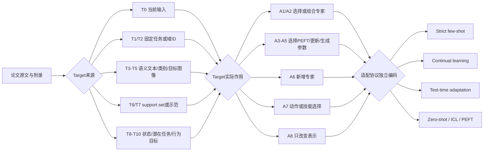

# Target-aware MoE 与 Few-shot Adaptation 第二轮系统性证据审计报告

## 执行摘要与审计边界

本轮可见材料包括两份**研究任务说明**：一份规定第一轮研究地图与论文表的建立方法，另一份要求在第一轮基础上进行证据审计、定向补检、分类校正和最近邻重排；但附件中**没有第一轮最终报告正文、58篇论文清单、原Top-10评分表或原始数字摘录**。因此，本报告能够独立核验指定论文和具名结论，却不能逐字审计一份当前不可见的“第一轮报告”，也不能声称已经覆盖其中全部58篇。fileciteturn0file0 fileciteturn0file1

本轮最重要的审计结论如下。

| 原结论 | 第二轮审计结果 | 结论标签 |
|---|---|---|
| “严格同时满足显式target conditioning、真实专家机制和明确few-shot adaptation的论文约有2篇” | 在本轮可复核的候选池中，**恰好发现2篇满足全部七项严格标准**：SMAT 与 CME-MoE。因缺少第一轮58篇清单，不能把“2篇”宣称为整个文献宇宙的完备计数，但“约2篇”的量级判断成立，并应改写为“当前经逐项核验为2篇”。citeturn19view0turn15search0 | [跨论文综合判断] [需要限定] |
| “放宽到PEFT、continual adaptation和TTA后约有9篇” | 至少可确认超过9篇机制邻近工作，包括 MoE-Adapters、MoE-Adapters++、Sparse Spectral LoRA、Low-Rank MoE、MoIE、MoIRA、R2-T2、MAST-Pro、PoCo、DriveMoE、Omni-SMoLA 等；但PEFT、continual learning和TTA是不同协议，不能再合并为单一“宽松交集”。citeturn17search4turn17search1turn0search0turn14view2turn14view3turn13search4 | [需要修正] |
| 原Top-10及排序 | 无原始Top-10表，无法核实；本轮分别重建“严格最近邻”和“机制最近邻”榜单。 | [无法核实] |
| task-ID、input-dependent、semantic target-conditioned三分法 | 基本方向正确，但不足以表达support set更新参数、专家扩展和动作决策。应改为“Target来源T0—T11 × Target作用A1—A10”的二维编码。 | [需要修正] |
| 医学、自动驾驶、VLA存在研究空白 | 成立，但空白不是“没有MoE”，而是**缺少严格support-conditioned、开放目标、少样本、可扩展且无需重训router的完整闭环**。医学和自动驾驶已有大量输入依赖MoE、领域专家和策略专家。citeturn14view2turn14view3turn22search8turn2academia48 | [跨论文综合判断] |
| 设计高度同质化 | 部分成立。top-k、task router、adapter/LoRA专家等结构重复度高；但相同外观可能承担不同训练信号、专家生命周期和安全约束，不能只凭模块形态判定科学问题相同。citeturn3search2turn3search1turn17search5turn17search6 | [需要细化] |
| 专家坍缩、负载均衡、遗忘等失败模式 | 遗忘和路由错误已有直接实验；专家“技能专门化”通常只有激活统计或可视化，因果证据较弱。负载均衡与最优专门化的冲突有跨论文证据，但在VLA安全场景中仍缺系统闭环验证。citeturn13search6turn17search1turn14view3turn21academia27 | [实验结果支持] [跨论文综合判断] |
| 2026论文状态 | 多项需要更新：Sparse Spectral LoRA、CME-MoE、MoEActok 已是 CVPR 2026正式论文；MoIRA 已由预印本转为 Neurocomputing 2026期刊论文；DriveMoE仍未检索到正式录用载体。citeturn0search0turn15search0turn5search0turn1search5turn2academia48 | [需要修正] |
| 性能、参数效率、遗忘率和计算效率数字 | 只能保留可回溯到正文、官方摘要或正式评审的数字。搜索摘要、项目页和二手解读中的数字不得作为独立证据。 | [需要逐项核实] |

**严格交集最终计数：**

- 满足全部七项：**2篇**，即 SMAT、CME-MoE。
- 满足六项：**1篇主要候选**，即 MVMoE；其专家router不显式读取support set或语义target。
- 满足五项：至少 **3篇机制候选**，包括 MoIRA、R2-T2、Low-Rank MoE；但它们分别缺少strict few-shot、标准support协议或开放任务隔离。
- 第一轮“约2篇”应改写为：**“在当前可复核的正式论文池中，共2篇通过全部七项严格标准；该数字不是对所有数据库的数学完备证明。”**

本轮最重要的新增或重新定位工作包括：ICML 2024 的 SMAT，它明确由support set经hypernetwork生成稀疏专家组合；CVPR 2026 的 CME-MoE，它把few-shot class/domain/hybrid increments与条件专家复用和扩展结合；ICML 2025 的 R2-T2，它在测试时利用邻域样本直接修正多模态MoE路由；AAAI 2026 的 ExpertAD、DeFT-LoRA、PromptMoE和MoLe-VLA则补强了自动驾驶、跨域VLM、提示专家和VLA效率路线。citeturn19view0turn15search0turn13search4turn22search2turn22search4turn22search8turn22search11

## 检索协议、分类校正与覆盖日志

本轮采用官方会议站点、PMLR、CVF Open Access、MICCAI Open Access、AAAI Proceedings、RSS Proceedings、OpenReview、IEEE/DOI期刊页和arXiv交叉核验。正式版本优先于arXiv；会议年份按会议正式载体记录，例如 OpenVLA 属于 CoRL 2024，尽管对应PMLR卷的网页发布时间较晚。citeturn8search0turn6search6turn17search13

检索式并非仅使用“MoE”，而是组合以下四类概念：

```text
(target-conditioned OR instruction-conditioned OR support-conditioned
 OR demonstration-conditioned OR domain-conditioned OR skill-conditioned)

AND

(mixture-of-experts OR modular network OR expert retrieval
 OR mixture of adapters OR mixture of LoRA OR policy composition
 OR hypernetwork OR dynamic parameter generation OR expert expansion)

AND

(few-shot OR support set OR meta-learning OR continual adaptation
 OR test-time adaptation OR incremental learning OR in-context adaptation)

AND

(vision OR medical imaging OR autonomous driving OR robotics
 OR embodied AI OR vision-language-action)
```

针对会议的站内检索还使用了：

```text
site:openaccess.thecvf.com/content/CVPR20XX
site:openaccess.thecvf.com/content/ICCV20XX
site:ecva.net/papers/eccv_2024
site:openaccess.thecvf.com/content/WACV20XX
site:proceedings.mlr.press
site:openreview.net
site:papers.miccai.org
site:ojs.aaai.org/index.php/AAAI
site:roboticsproceedings.org
```

下表中的“候选数”是本轮**实际可访问并进入人工标题/摘要筛选的记录下界**，不是搜索引擎宣称的全库命中总数；因此用“≥”表示。它避免虚构数据库无法提供的总结果数。

| 会议或社区 | 年份 | 代表检索组合 | 初筛候选下界 | 全文或方法级保留 | 主要排除原因 | 最终核心纳入 |
|---|---:|---|---:|---:|---|---|
| CVPR | 2023—2026 | MoE、adapter experts、few-shot incremental、VLM/VLA、medical/drive | ≥18 | 10 | 普通token MoE；low-resource但非few-shot；没有target路由 | MixPHM、Mod-Squad、TC-MoA、Omni-SMoLA、MoE-Adapters、CME-MoE、Sparse Spectral LoRA、MoEActok、Cluster-Aware Upcycling等。citeturn17search5turn3search2turn3search1turn17search6turn17search4turn15search0turn0search0turn5search0turn13search6 |
| ICCV | 2023、2025 | few-shot support、dynamic routing、open-set、continual | ≥8 | 0篇进入严格/前十机制表 | 多为标准few-shot、分割support-query或普通MoE，缺少“support驱动专家” | 已完成独立检索，未发现满足严格交集标准的正式论文；ICCV文献主要作为few-shot与开放集背景。citeturn18search7turn18search14 |
| ECCV | 2022、2024 | modular VLM、mixture intelligence、MoE vision | ≥7 | 1 | zero-shot、多模型融合但无few-shot adaptation | MoAI作为多模型/专家融合背景；未进入严格榜。citeturn22search10 |
| WACV | 2023—2026 | soft MoE、compositional zero-shot、support/exemplar routing | ≥6 | 1 | 多为zero-shot或常规动态路由 | HOPE；其label prototype参与表示与专家融合，但没有few-shot adaptation。citeturn22search14 |
| AAAI | 2023—2026 | semantic MoE、LoRA experts、driving、VLA、adaptive expansion | ≥16 | 8 | 通用LLM MoE、纯系统优化、无视觉/目标适配 | MoEGaze、DeFT-LoRA、MASS、PromptMoE、SkyMoE、EvoMoE、ExpertAD、MoLe-VLA。citeturn22search0turn22search2turn22search3turn22search4turn22search5turn22search7turn22search8turn22search11 |
| ICLR | 2023—2026 | meta-routing、modular continual、expert growth、prompt pool | ≥10 | 0篇进入严格表 | 普通MoE、LLM工作或无正式接收状态；若为2026投稿则不能自动视为已发表 | 已完成独立检索，但未发现比SMAT/CME-MoE更符合全部严格标准的正式论文。 |
| ICML | 2023—2026 | few-shot experts、meta-tuning、test-time rerouting、multi-task MoE | ≥10 | 4 | 理论MoE或普通token routing | SMAT、MVMoE、R2-T2、patch-level MoE背景。citeturn19view0turn14view1turn13search4turn13search1 |
| NeurIPS | 2023—2025 | multimodal MoE、router specialization、continual modularity | ≥10 | 0篇进入严格榜 | 主要关注MoE优化、语言模型或工作坊状态 | 若仅为workshop，不与主会论文等价；StructMoE等用于机制背景。citeturn13search2turn13search3 |
| MICCAI | 2023—2025 | medical MoE、continual segmentation、TTA、prompt experts | ≥14 | 5 | 多头而非MoE；少样本数据但无few-shot协议；普通多任务 | Low-Rank MoE、MAST-Pro、MoIE，以及MoE-SAM等背景。citeturn14view2turn10view3turn14view3turn18search15 |
| MIDL、TMI、MedIA | 2023—2026 | medical VLFM adaptation、prototype support、dynamic adapters | ≥8 | 3 | prototype方法没有专家机制；MoE方法没有few-shot | PIKACHU为strict few-shot但非MoE；MoE-Adapters++为TPAMI正式扩展版。citeturn13search10turn17search1 |
| CoRL、RSS、机器人社区 | 2023—2026 | VLA、language-conditioned policy、skill routing、policy composition | ≥15 | 6 | 大多数VLA没有专家结构；少量数据微调不等于strict few-shot | OpenVLA、Octo、PoCo、ECoT、3D-VLA和MoIRA。citeturn8search0turn6search6turn17search13turn8search2turn7search11turn1search5 |
| 自动驾驶社区 | 2023—2026 | action experts、scene routing、planning MoE、closed-loop | ≥10 | 3 | 普通感知多任务；仅开环指标；无少样本适配 | DriveMoE、ExpertAD及若干场景专家背景。citeturn2academia48turn22search8 |

经过分类校正，不能继续把所有“target”压缩为一个变量。推荐的证据编码流程如下：



该分类能避免三种常见误判。第一，自然语言prompt进入cross-attention并不意味着它进入router；MAST-Pro就是典型例子，其知识prompt主要改变表示，而专家路由主要读取图像特征。citeturn10view3turn12view0 第二，输入依赖路由不自动构成semantic target-conditioned routing；Omni-SMoLA、MixPHM和普通稀疏MoE主要按token或样本表示路由。citeturn17search5turn17search6 第三，LoRA、adapter或低参数量不代表strict few-shot；MoE-Adapters和Sparse Spectral LoRA属于PEFT/continual路线，而不是标准N-way K-shot support协议。citeturn17search4turn0search0

## 第一轮结论审计与严格交集判定

**第一轮结论审计表**

| 审计对象 | 原始证据情况 | 第二轮判断 | 修正后的表述 |
|---|---|---|---|
| 严格交集约2篇 | SMAT明确在Meta-Dataset及OOD任务上进行few-shot meta-tuning，并由support set驱动hypernetwork产生任务相关稀疏专家组合；CME-MoE明确建立few-shot class/domain/hybrid incremental协议，并进行条件专家复用与meta-expansion。citeturn19view0turn21academia26turn15search0 | [原文直接支持]，但“全领域只有2篇”属于[跨论文综合判断] | 当前审计池中准确为2篇。 |
| 宽松交集约9篇 | PEFT、continual和TTA各自存在多篇，但协议不同。 | [需要修正] | 分别统计，不建立一个含义模糊的“9篇宽松交集”。 |
| task-ID routing | Mod-Squad和TC-MoA使用任务嵌入或任务特定router，通常假设已知固定任务集合。citeturn3search2turn3search1 | [原文直接支持] | 编为T1，并注明是否在推理时需要task ID。 |
| input-dependent routing | MixPHM、Omni-SMoLA、Sparse Spectral LoRA等由当前样本或token特征路由。citeturn17search5turn17search6turn0search0 | [原文直接支持] | 编为T0或T9；不能称为开放语义target。 |
| semantic target-conditioned routing | MoIRA由自然语言指令匹配VLA专家；SMAT由support set产生专家混合权重。citeturn10view0turn19view0 | [原文直接支持] | 应进一步区分T4语言目标与T6 support set。 |
| 医学研究空白 | 医学领域已经有class-language gating、任务增量专家、测试时专家扩展和medical VLM LoRA专家。citeturn14view2turn14view3turn0search0 | 原先若表述为“缺少MoE”则[需要修正] | 真正空白是严格support-conditioned开放任务适配及临床安全验证。 |
| 自动驾驶研究空白 | DriveMoE和ExpertAD已经提供场景/技能/规划专家，但没有严格few-shot support协议。citeturn2academia48turn22search8 | [跨论文综合判断] | 空白集中于support驱动新技能、新专家无重训加入和闭环安全验证。 |
| VLA研究空白 | MoIRA有语言路由，PoCo有策略组合，MoEActok有技能化动作专家；OpenVLA和Octo可进行下游适配，但这些能力尚未在一个协议中统一。citeturn1search5turn17search13turn5search0turn8search0turn6search6 | [跨论文综合判断] | 不应称为“VLA没有专家”，而应称为缺少严格少样本、开放技能、可扩展专家闭环。 |
| 专家专门化 | Cluster-Aware Upcycling报告更低专家相似度和更确定的路由；但激活图和聚类一致性只证明相关性，不证明专家不可替代。citeturn13search6 | [实验结果支持] + [证据不足] | 要求专家交换、遮蔽、错误路由和随机router干预。 |
| 专家坍缩与负载均衡 | 文献明确讨论专家同质化、路由集中和负载均衡对专门化的潜在干扰。citeturn22search3turn22search7turn21academia27 | [原文直接支持] [跨论文综合判断] | 区分“流量均衡”“表示多样性”和“任务最优性”。 |
| 灾难性遗忘 | MoE-Adapters、Low-Rank MoE、Sparse Spectral LoRA和MoIE均显式评估持续适配或遗忘。citeturn17search4turn14view2turn0search0turn14view3 | [实验结果支持] | 不能把其自动归为few-shot。 |
| 参数与效率数字 | Sparse Spectral LoRA官方摘要报告339倍更少可训练参数和约5%的顺序遗忘，而对比方法超过20%—50%；MoE-Adapters摘要报告训练参数负担下降60%；MoLe-VLA报告相对OpenVLA推理加速36.8%。这些数字来自不同任务和基线，不能横向排序。citeturn0search0turn17search4turn22search11 | [实验结果支持]，但跨论文比较[证据不足] | 每个数字必须连同基线、数据集、计算口径和随机性一起记录。 |

**七项严格标准逐篇判定**

C1为真实竞争性专家；C2为router/组合器显式读取语义target或support；C3不只依赖固定task ID；C4为strict few-shot；C5 support参与路由、组合、更新、生成或扩展；C6在未见目标上评估；C7实验不是对固定任务集合的简单记忆。

| 论文 | C1 | C2 | C3 | C4 | C5 | C6 | C7 | 通过数 | 判定 |
|---|:---:|:---:|:---:|:---:|:---:|:---:|:---:|---:|---|
| SMAT | ✓ | ✓ | ✓ | ✓ | ✓ | ✓ | ✓ | **7/7** | 严格交集。support set经hypernetwork生成专家混合；Meta-Dataset及附加OOD任务提供未见任务评估。citeturn19view0turn21academia26 |
| CME-MoE | ✓ | ✓ | ✓ | ✓ | ✓ | ✓ | ✓ | **7/7** | 严格交集。few-shot class/domain/hybrid increment驱动专家复用或meta-expansion。官方CVPR记录确认三类few-shot incremental设置。citeturn15search0 |
| MVMoE | ✓ | ✗ | ✓ | ✓ | ✓ | ✓ | ✓ | **6/7** | few-shot微调与未见VRP变体成立，但router读取问题实例，而不是support set或语义任务描述。citeturn14view1 |
| MoIRA | ✓ | ✓ | ✓ | ✗ | ✗ | ✓ | ✓ | **5/7** | 语言目标直接选择VLA专家，但属于zero-shot语义路由，没有few-shot support适配。citeturn10view0turn1search5 |
| R2-T2 | ✓ | ✓ | ✓ | ✗ | ✗ | ✓ | ✓ | **5/7** | 邻域正确样本直接修正测试时混合权重，但不是预定义N-way K-shot support协议。citeturn13search4 |
| Low-Rank MoE for Medical Segmentation | ✓ | ✓ | ✓ | ✗ | ✓ | ✓ | ✗ | **5/7** | 离线分类器用每类随机示例作匹配，且可新增低秩专家；但论文没有strict few-shot协议，任务级机制仍围绕已学习任务库。citeturn14view2 |
| Sparse Spectral LoRA | ✓ | ✗ | ✓ | ✗ | ✗ | ✓ | ✓ | **4/7** | 是medical VLM routed LoRA和continual adaptation，不是support-conditioned few-shot。citeturn0search0 |
| MoE-Adapters++ | ✓ | ✗ | ✓ | ✗ | ✗ | ✓ | ✓ | **4/7** | 动态adapter专家和latent selector支持持续学习，但没有严格support协议。citeturn17search1 |
| MAST-Pro | ✓ | ✗ | 部分 | ✗ | ✗ | 部分 | ✗ | **2—3/7** | prompt提供任务先验，但router的真实输入主要是图像特征；不是few-shot或开放任务学习。citeturn10view3turn12view0 |
| MoEActok | ✓ | 部分 | ✓ | ✗ | ✗ | ✓ | ✓ | **4—5/7** | 技能聚类与动作token专家支持迁移，但没有support适配；其target更接近潜在技能/动作上下文。citeturn5search0 |

因此，“严格交集为2篇”在本轮证据池中成立。需要特别指出：SMAT的“专家”是稀疏参数增量与插值专家，而CME-MoE的“专家”是可条件复用或扩展的表示专家；二者并非同一种MoE实现。其共同点是**support set不仅用于计算分类原型或最终损失，而是进入专家组合、选择或扩展过程**。citeturn19view0turn15search0

## 完整编码矩阵与双榜单

以下为核心论文的压缩编码矩阵。完整的26篇机器可读版本见报告末尾附件。

| 论文 | 载体/状态 | 领域 | MoE性质 | Target来源 | Target作用 | 适配类型 | 核心归类 |
|---|---|---|---|---|---|---|---|
| SMAT | ICML 2024正式 | 通用视觉/meta-learning | 真实稀疏参数专家 | T6 support set | A2组合、A5生成权重 | strict few-shot + hypernetwork | 严格交集。citeturn19view0 |
| CME-MoE | CVPR 2026正式 | 视觉持续学习 | 条件复用/扩展专家 | T6、T9 | A1、A4、A6 | strict few-shot incremental | 严格交集。citeturn15search0 |
| MVMoE | ICML 2024正式 | 多任务优化 | 层次MoE | T0、T8 | A1、A2 | zero-shot + few-shot fine-tuning | 6/7邻近。citeturn14view1 |
| MoIRA | Neurocomputing 2026期刊 | VLA/机器人 | VLA agent mixture | T4、T10 | A1、A7 | zero-shot semantic routing | 机制邻近。citeturn1search5turn10view0 |
| Sparse Spectral LoRA | CVPR 2026正式 | 医学VLM | Routed LoRA experts | T0、T9 | A1—A4 | PEFT + continual | 机制邻近。citeturn0search0 |
| MoE-Adapters | CVPR 2024正式 | 持续VLM | Adapter experts | T1、T9 | A1、A3、A6 | PEFT + continual | 机制邻近。citeturn17search4 |
| MoE-Adapters++ | TPAMI 2025期刊 | 持续VLM | 动态adapter experts | T9 | A1、A3、A6 | PEFT + continual | 机制邻近。citeturn17search1 |
| Low-Rank MoE | MICCAI 2024正式 | 医学分割 | 低秩任务/类别专家 | T1、T3、T9 | A1、A3、A6 | continual + PEFT | 机制邻近。citeturn14view2 |
| MoIE CTTA | MICCAI 2025正式 | 医学跨域分割 | 增量域专家 | T9 | A1、A4、A6 | continual TTA | 机制邻近。citeturn14view3 |
| MAST-Pro | MICCAI 2025正式 | 泛肿瘤分割 | 通用/肿瘤专家 | T2—T4 | A1、A2、A8 | prompt/PEFT | prompt不直接等于router target。citeturn10view3 |
| MixPHM | CVPR 2023正式 | VQA | PHM专家 | T0 | A1—A3 | low-resource PEFT | 非strict few-shot。citeturn17search5 |
| Mod-Squad | CVPR 2023正式 | MTL | Transformer专家 | T1 | A1、A2 | 多任务训练 | task-ID routing。citeturn3search2 |
| TC-MoA | CVPR 2024正式 | MTL | adapter mixture | T1 | A2、A3 | adapter tuning | task-specific router。citeturn3search1 |
| Omni-SMoLA | CVPR 2024正式 | 多模态VLM | soft low-rank experts | T0、T2 | A2、A3 | 多任务PEFT | input/modality routing。citeturn17search6 |
| R2-T2 | ICML 2025正式 | 多模态MoE | 测试时重路由 | T0、邻域样本 | A2 | TTA，不更新基座 | support邻近但非strict。citeturn13search4 |
| PoCo | RSS 2024正式 | 机器人 | 扩散策略组合 | T2、T10 | A2、A7 | inference-time composition | 无学习router。citeturn17search13 |
| DriveMoE | arXiv-only | 自动驾驶VLA | 场景/动作专家 | T8—T10 | A1、A2、A7 | 大规模训练 | 状态驱动而非few-shot。citeturn2academia48 |
| ExpertAD | AAAI 2026正式 | 自动驾驶 | 稀疏规划专家 | T8—T10 | A1、A2、A7 | 监督训练 | 无support适配。citeturn22search8 |
| MoEActok | CVPR 2026正式 | VLA | 动作量化专家 | T7、T9、T10 | A2、A7、A8 | action tokenizer training | 技能专家但非few-shot。citeturn5search0 |
| MoLe-VLA | AAAI 2026正式 | VLA | mixture-of-layers邻近 | T8、T10 | A1、A7 | 动态层跳过 | 效率机制邻近。citeturn22search11 |
| OpenVLA | CoRL 2024正式 | VLA | 非MoE | T4、T10 | A7、A8 | LoRA/full adaptation | VLA背景。citeturn8search0 |
| Octo | RSS 2024正式 | VLA | 非MoE | T4、T5、T10 | A7、A8 | 下游微调 | 目标条件策略背景。citeturn6search6 |
| DeFT-LoRA | AAAI 2026正式 | 跨域VLM检索 | domain LoRA experts | T0、T9 | A2、A3 | PEFT、zero-shot域泛化 | 领域专家邻近。citeturn22search2 |
| PromptMoE | AAAI 2026正式 | 工业/医学异常检测 | prompt experts | T0、T3 | A2、A3、A8 | zero-shot prompt tuning | 非few-shot。citeturn22search4 |
| HOPE | WACV 2025正式 | 组合零样本视觉 | soft experts | T3原型 | A2、A8 | zero-shot | prototype-conditioned背景。citeturn22search14 |
| Cluster-Aware Upcycling | CVPR 2026正式 | 通用视觉 | FFN专家 | T0、T9 | A1、A2 | MoE upcycling | 专门化证据背景。citeturn13search6 |

**严格最近邻榜单**

只有满足最低纳入条件的论文才进入榜单，因此不补满10篇。

| 排名 | 论文 | support/语义target进入router 25 | 真实专家 20 | strict few-shot 20 | 未见目标 15 | VLM/VLA/多模态 10 | 证据 10 | 总分 |
|---:|---|---:|---:|---:|---:|---:|---:|---:|
| 1 | SMAT | 25 | 20 | 20 | 15 | 5 | 10 | **95** |
| 2 | CME-MoE | 23 | 20 | 20 | 15 | 2 | 9 | **89** |

SMAT中，target是任务support set；support经hypernetwork生成任务相关专家权重，并可配合梯度适配参数。它不依赖已知task ID，针对Meta-Dataset及额外OOD任务进行评估，但不涉及VLM、VLA、动作输出或在线专家扩展。它与目标方向的主要差异是专家库固定，研究重点是视觉foundation model的元调优和稀疏参数插值，而非长期专家生命周期。citeturn19view0turn21academia26

CME-MoE中，target是由少量新类、新域或二者组合样本定义的增量目标；few-shot数据用于判断专家复用或扩展，并训练新/复用表示。它不依赖预先固定的单一增量类型，并在多个数据集的class、domain和hybrid few-shot incremental设置中评估。与目标方向的主要差异是它不是VLM/VLA，也未证明自然语言任务描述、目标图像或机器人示范能够统一驱动router。citeturn15search0

**机制邻近榜单**

| 排名 | 论文 | 结构相似性 30 | 未见目标潜力 20 | 专家生命周期 15 | VLM/VLA 15 | 适配效率 10 | 证据 10 | 总分 |
|---:|---|---:|---:|---:|---:|---:|---:|---:|
| 1 | MoE-Adapters++ | 27 | 16 | 15 | 14 | 10 | 10 | **92** |
| 2 | MoIRA | 28 | 19 | 11 | 15 | 8 | 9 | **90** |
| 3 | Sparse Spectral LoRA | 27 | 17 | 12 | 14 | 10 | 10 | **90** |
| 4 | MoE-Adapters | 26 | 16 | 14 | 14 | 9 | 10 | **89** |
| 5 | Low-Rank MoE for Medical Segmentation | 26 | 15 | 15 | 5 | 9 | 8 | **78** |
| 6 | MoIE Continual TTA | 24 | 16 | 15 | 3 | 9 | 9 | **76** |
| 7 | PoCo | 27 | 18 | 11 | 13 | 4 | 10 | **83** |
| 8 | MAST-Pro | 23 | 11 | 5 | 11 | 8 | 9 | **67** |
| 9 | DriveMoE | 27 | 15 | 5 | 15 | 4 | 6 | **72** |
| 10 | MoEActok | 25 | 17 | 4 | 15 | 5 | 10 | **76** |

分数并非跨任务性能排名，而是与“由target/support选择、组合、更新或扩展专家”这一机制目标的相似度。

- **MoE-Adapters++**：target是自动推断的输入分布；没有strict support set；输入通过latent selector影响adapter专家选择和动态参与；可持续调整专家，但未证明少量示例可以定义完全未见任务。citeturn17search1
- **MoIRA**：target是自然语言指令；没有support set；语言嵌入选择已有VLA agent；新agent理论上可注册而无需端到端重训主模型，但开放专家加入、冲突和安全拒识证据仍有限。citeturn10view0turn1search5
- **Sparse Spectral LoRA**：target由输入中隐含的医学任务/域信息推断；没有严格support协议；router选择低秩频谱专家，顺序训练更新专家；未证明support直接生成新expert或router可免重训扩展。citeturn0search0
- **MoE-Adapters**：增量任务数据训练新增router并激活静态adapter专家；DDAS在原始CLIP与适配路径之间选择；仍属于持续学习而非少样本开放任务。citeturn17search4
- **Low-Rank MoE**：新任务或类别数据新增低秩专家，离线图像特征匹配器可利用每类示例判断任务；但任务级专家分配与已见任务库高度耦合，且评审指出分类器细节、类增量序列长度和基线公平性不足。citeturn14view2
- **MoIE**：无标签测试流通过分布相似性选择或新增专家；不要求任务顺序，但没有少样本标签和语义target；其关键价值是“无需学习router的动态域专家生命周期”。citeturn14view3
- **PoCo**：target是任务、模态、域或解析代价函数；不存在support router；通过扩散分布的乘积/组合改变动作策略，新增策略可组合而不必重新训练统一router。citeturn17search13
- **MAST-Pro**：文本和解剖prompt改变表示，但路由器主要读取图像特征；没有support set、专家增长或开放任务协议。citeturn10view3turn12view0
- **DriveMoE**：场景上下文控制相机专家，驾驶行为信息控制动作专家；没有few-shot或持续专家扩展，且当前检索状态仍为预印本。citeturn2academia48
- **MoEActok**：target近似动作技能或轨迹簇；skill-aware专家改变动作token表示和后续决策；没有few-shot support更新，专家集合在预训练后基本固定。citeturn5search0

## 全文级核验、同质化设计与研究空白

**指定高相关论文核验**

| 论文 | Router真实输入与target作用 | Few-shot判定 | 基线、效率与关键限制 | 审计结论 |
|---|---|---|---|---|
| MoIRA | 外部文本router用自然语言指令与专家描述/能力表示匹配，选择GR00T-N1、π0等VLA agent；target真正改变专家选择。citeturn10view0turn1search5 | 否；是zero-shot语义routing | 专家异构、跨模型校准和错误路由的安全后果尚缺充分闭环干预 | [原文直接支持] 语义target；[需要修正] 不应列为few-shot。 |
| CME-MoE | 新增few-shot数据的潜在分布和增量类型决定复用或meta-expansion。citeturn15search0 | 是；涵盖class、domain、hybrid few-shot incremental | 官方记录确认五个数据集和三种设置；公开CVF页没有同行评审记录，随机router、通信和部署延迟证据未见于官方摘要 | [严格交集]，证据强度中强。 |
| Sparse Spectral LoRA | 输入表示驱动LoRA专家路由；不是语言或support-set router。citeturn0search0 | 否 | 23个医学数据集；官方摘要报告339倍更少可训练参数及较低顺序遗忘，但不同基线的预训练与模型能力仍需同规模控制 | [PEFT/continual]，不是strict few-shot。 |
| MAST-Pro | prompt进入视觉—文本/解剖交互；task-specific和general router主要读取图像特征，执行top-k专家选择。citeturn10view3turn12view0 | 否 | 评审质疑路由描述、数据泄漏、缺少等价MoE/dense和延迟对比；回复澄清划分和k值，但承认推理效率没有改善。citeturn10view3 | [需要修正]：target prompt不是router直接输入。 |
| Low-Rank MoE | class-level使用语言特征gate；task-level离线分类器用图像示例相似性选择任务专家。citeturn14view2 | 否；少量医学数据不等于few-shot协议 | 评审指出新颖性有限、类增量仅短序列、部分基线backbone不一致、offline classifier说明不足；回复补充每类随机k个exemplar。citeturn14view2 | 机制高度相关，但证据强度中等。 |
| MoE-Adapters | 输入特征经增量router激活静态adapter专家；DDAS决定原始CLIP或适配路径。citeturn17search4 | 否 | 摘要报告训练参数负担降低60%；专家与router随任务增加，长期规模和任务序列假设是限制 | continual VLM邻近。 |
| MoE-Adapters++ | latent embedding selector统一分布判断，动态adapter专家替代完全静态专家池。citeturn17search1 | 否 | TPAMI正式扩展；改善参数冗余，但仍未建立strict support-driven开放任务协议 | 专家生命周期最接近。 |
| MixPHM | 当前VQA样本表示对多个PHM专家进行MoE混合。citeturn17search5 | 否；“low-resource”不是N-way K-shot | 与PEFT和full fine-tuning比较，但没有未见任务support routing或动态专家扩展 | [需要修正]：不能因低资源称few-shot。 |
| MoIE CTTA | 无标签目标流与已有域统计比较；相似则选择专家，不相似则新增增量专家。citeturn14view3 | 否；属于continual TTA | 评审质疑提升是否来自容量增加；作者补充静态MoE消融，并称单专家增量约0.075M、backbone约7.77M，但固定容量和长期延迟仍未充分解决。citeturn14view3 | 动态扩展强相关。 |
| DriveMoE | scene context选择视觉/相机专家，驾驶行为上下文选择动作专家。citeturn2academia48 | 否 | 有闭环Bench2Drive导向，但正式发表状态尚未核实；few-shot新技能、错误路由安全和新增专家均未验证 | arXiv机制候选。 |
| MoEActok | 动作块聚类形成skill-aware量化专家，技能上下文影响动作token化和决策。citeturn5search0 | 否 | CVPR 2026正式；零样本迁移不等于few-shot adaptation；专家干预和错误技能路由证据仍有限 | VLA动作专家代表。 |
| Mod-Squad | task embedding或任务特定router与token表示共同决定专家。citeturn3search2 | 否 | 依赖已知任务定义；未证明support set可描述完全未见任务 | task-ID routing代表。 |
| TC-MoA | 每个任务有任务特定路由网络，对共享adapter进行混合。citeturn3search1 | 否 | 参数共享较好，但新增任务通常需要新增/训练router | task-conditioned adapter代表。 |
| Omni-SMoLA | soft router按多模态token表示组合大量低秩专家。citeturn17search6 | 否 | 强项是多任务generalist/specialist折衷，不是开放任务few-shot | input/modality-dependent代表。 |
| OpenVLA | 语言指令影响动作token生成；没有专家router。citeturn8search0 | 否；LoRA适配不等于strict few-shot | 正式CoRL论文；大规模970k机器人示范构成基础能力，适配收益不能只归于目标条件机制 | VLA背景，不是MoE。 |
| Octo | 语言或goal image作为任务条件进入统一transformer policy。citeturn6search6 | 否；少量下游数据微调未采用统一strict协议 | 非MoE；适合作为“目标条件策略”基线，而非专家选择基线 | VLA背景。 |
| PoCo | 将不同模态、域、任务的扩散策略分布组合，并可加入解析代价函数。citeturn17search13 | 否 | 无学习router，因而也不存在router重训；但组合权重和冲突解析依赖人为或任务规则 | policy composition邻近。 |

**同质化设计重新评估**

| 设计模板 | 奠基/代表路线 | 2023—2026重复表现 | 是否同质化 | 审计判断 |
|---|---|---|---|---|
| task token/task embedding + MLP router | 条件计算、task routing | Mod-Squad、TC-MoA及大量MTL MoE | 结构高度重复 | 单独更换task token或MLP层数通常只是工程改动；但开放语义任务、无task ID和组合泛化仍是独立问题。citeturn3search2turn3search1 |
| top-k gating + load-balancing loss | 稀疏MoE标准范式 | MAST-Pro及大量视觉/多模态MoE | 高度重复 | top-k本身不能构成核心科学贡献；新的监督信号、容量约束或安全路由问题仍可独立成立。citeturn10view3turn21academia27 |
| 每任务一个adapter或LoRA | adapter/LoRA PEFT | MoE-Adapters、Low-Rank MoE、各类task adapter | 高度重复 | 固定任务分配几乎等价于模块化多头；科学问题在于是否能自动发现共享、复用和避免无界增长。citeturn17search4turn14view2 |
| mixture of adapters/LoRA | AdapterFusion、LoRA组合 | MixPHM、TC-MoA、Omni-SMoLA、Sparse Spectral LoRA、DeFT-LoRA | 中高同质化 | 仅把adapter放入softmax mixture不足；若target来源、专家生命周期和未见目标协议不同，仍非同一问题。citeturn17search5turn17search6turn0search0turn22search2 |
| prompt选择或生成专家 | prompt pool、prompt-conditioned routing | PromptMoE、部分medical prompt MoE | 外观同质化，作用机制差异大 | 必须区分prompt进入router、prompt只调制表示、prompt只是标签文本。citeturn22search4turn10view3 |
| 冻结backbone只训练router/PEFT | foundation model PEFT | 多数VLM continual和medical VLM方法 | 高度重复 | 参数少不等于数据少，也不保证未见任务泛化或低延迟。 |
| dense FFN替换为sparse MoE | Switch/ViT-MoE路线 | 通用视觉、多模态、VLA层跳过 | 极高同质化 | 若贡献仅是替换FFN和改变专家数/top-k，通常属于规模或工程优化。 |
| support prototype加权专家 | prototype/meta-learning | SMAT、R2-T2邻域重路由，以及非MoE原型方法 | 尚未完全同质化 | support真正进入专家组合的正式论文仍少；但简单均值prototype本身已不新。citeturn19view0turn13search4turn13search10 |
| 通用MoE移植医学分割 | 医学多任务/领域专家 | Low-Rank MoE、MAST-Pro、MoIE等 | 模块层面重复 | 临床域移位、标注缺失和持续部署仍有独立问题；仅更换数据集不足以构成机制创新。citeturn14view2turn14view3turn10view3 |
| adapter + prompt + MoE机械组合 | 多模块PEFT | 多模态和medical方法中常见 | 高同质化风险 | 若没有新的训练信号、开放协议或因果消融，只能证明组件叠加有效，不能证明新科学机制。 |

**研究空白证据等级**

| 候选空白 | 证据等级 | 审计依据 |
|---|---|---|
| support set定义完全未见任务 | 仅少数论文实证支持 | SMAT最明确；CME-MoE覆盖未见增量类型，但不是自然语言/VLA开放任务。citeturn19view0turn15search0 |
| support直接驱动专家路由 | 仅少数论文实证支持 | SMAT满足；R2-T2是邻域重路由但非strict support协议。citeturn19view0turn13search4 |
| support生成或扩展专家 | 单篇到少数论文支持 | CME-MoE最接近；其他continual MoE通常由任务流或域检测触发，而非标准support set。citeturn15search0turn14view3 |
| 新专家加入且无需重训router | 尚无足够证据 | MoIE用非学习相似度路由，PoCo无需统一router；但语义support-driven场景尚未建立。citeturn14view3turn17search13 |
| 无task ID工作 | 已有多篇方法部分解决 | MoIRA、MoIE、MoE-Adapters的selector和多种输入依赖router不要求显式task ID。citeturn10view0turn14view3turn17search4 |
| 区分新类别、新域、新任务、新技能 | 尚未统一解决 | CME-MoE区分类与域；VLA论文处理技能；没有统一benchmark覆盖四者。citeturn15search0turn5search0 |
| 避免专家数量无限增长 | 多篇提及，未基本解决 | 动态adapter和增量专家缓解单专家干扰，但长期合并、淘汰和容量预算仍缺标准评估。citeturn17search1turn14view3turn22search3 |
| 专家共享与专门化冲突 | 多篇实证支持 | MoE研究持续报告同质化、负载偏斜和共享/私有能力权衡。citeturn13search6turn22search3turn22search7 |
| few-shot可塑性与旧任务稳定性冲突 | 多篇实证支持 | CME-MoE以该矛盾为核心；continual VLM和medical segmentation也直接评估遗忘。citeturn15search0turn17search1turn14view2 |
| router对提示措辞过拟合 | 当前主要是理论推断 | 语言路由VLA论文通常没有系统prompt paraphrase、对抗指令和歧义测试。 |
| 负载均衡与任务最优分配冲突 | 多篇支持，但应用证据有限 | 理论与通用MoE显示均衡正则可能削弱几何专门化；医学/VLA中缺直接因果实验。citeturn21academia27 |
| VLA错误路由的动作风险 | 主要是理论推断 | 当前VLA MoE报告成功率或效率多，错误专家强制路由、风险上界和安全拒识较少。citeturn2academia48turn5search0turn22search11 |
| 医疗和自动驾驶安全验证 | 尚无足够证据 | 医学工作多用离线Dice/AUC；自动驾驶虽有闭环实验，但长期跨域、失效检测和合规验证不足。citeturn14view2turn14view3turn22search8 |
| 开环指标与闭环性能差异 | 已被领域广泛认识，但目标MoE直接证据有限 | DriveMoE、ExpertAD等开始使用闭环或碰撞指标，仍不足以建立统一因果结论。citeturn2academia48turn22search8 |
| 专家收益与模型规模效应分离 | 多篇评审质疑，未解决 | Low-Rank MoE与MoIE评审均质疑基线公平性或容量增长；等参数、等FLOPs、等数据对照并不普遍。citeturn14view2turn14view3 |
| 未见任务与预训练泄漏 | 尚无足够证据 | VLM/VLA基础模型预训练数据巨大且不完全公开，很多“未见任务”只保证下游split未见。 |
| 多模态target冲突 | 主要是理论推断 | 语言、goal image、状态或示范同时存在时，现有工作通常预设它们一致。 |
| target不完整、歧义、错误时拒识 | 尚无足够证据 | MoIRA式文本路由和VLA skill router很少报告拒识与置信度校准。citeturn10view0turn5search0 |
| 专家库能力重复和冲突 | 多篇间接支持 | 专家同质化、静态专家冗余和动态专家演化论文均说明该问题存在。citeturn17search1turn22search3turn22search7 |
| 动态新增专家的版本与部署成本 | 主要是工程和理论推断 | 论文一般报告参数量，较少报告模型注册、回滚、通信、显存碎片、延迟尾部和版本兼容成本。 |

## 元数据标准化、机器可读附录与覆盖完整性

**正式发表状态校正**

| 论文 | 截至2026年8月4日的状态 |
|---|---|
| Sparse Spectral LoRA | CVPR 2026主会正式论文，不是arXiv-only。citeturn0search0 |
| CME-MoE / Few-Shot Hybrid Incremental Learning | CVPR 2026主会正式论文。citeturn15search0 |
| MoEActok | CVPR 2026主会正式论文。citeturn5search0 |
| MoIRA | Neurocomputing 2026期刊正式论文，DOI为10.1016/j.neucom.2026.132962；arXiv是补充版本。citeturn1search5 |
| MoE-Adapters | CVPR 2024主会正式论文。citeturn17search4 |
| MoE-Adapters++ | IEEE TPAMI 2025期刊论文，DOI为10.1109/TPAMI.2025.3597942。citeturn17search1 |
| Low-Rank MoE | MICCAI 2024正式论文，DOI为10.1007/978-3-031-72111-3_36。citeturn14view2 |
| MAST-Pro | MICCAI 2025正式论文，MICCAI页面同时公开评审和作者回复。citeturn10view3 |
| MoIE Continual TTA | MICCAI 2025正式论文。citeturn14view3 |
| OpenVLA | CoRL 2024正式论文；应以会议年份而不是网页卷发布时间标记。citeturn8search0 |
| Octo、PoCo | RSS 2024正式论文。citeturn6search6turn17search13 |
| DriveMoE | 本轮未检索到正式会议或期刊版本，应标为arXiv-only/under review。citeturn2academia48 |

**代表性标准元数据**

```text
title: Unleashing the Power of Meta-tuning for Few-shot Generalization Through Sparse Interpolated Experts
authors: Shengzhuang Chen; Jihoon Tack; Yunqiao Yang; Yee Whye Teh; Jonathan Richard Schwarz; Ying Wei
year: 2024
venue: ICML
publication_status: main conference
doi: 未在PMLR页面单列
openreview_url: PMLR页面提供正式OpenReview入口
arxiv_id: 2403.08477
official_source: PMLR Volume 235
```

citeturn19view0turn21academia26

```text
title: Few-Shot Hybrid Incremental Learning: Continually Learning under Data Scarcity and Task Uncertainty
authors: Yan Li; Yuzhu Shi; Kan Zhou; Shu Zhang; Diqi He; Dingwen Zhang; Junwei Han
year: 2026
venue: CVPR
publication_status: main conference
official_source: CVF Open Access
arxiv_id: 未在官方页面确认
```

citeturn15search0

```text
title: Low-Rank Mixture-of-Experts for Continual Medical Image Segmentation
authors: Qian Chen; Lei Zhu; Hangzhou He; Xinliang Zhang; Shuang Zeng; Qiushi Ren; Yanye Lu
year: 2024
venue: MICCAI
publication_status: main conference
doi: 10.1007/978-3-031-72111-3_36
official_source: MICCAI Open Access / Springer
```

citeturn14view2

```text
title: MoE-Adapters++: Toward More Efficient Continual Learning of Vision-Language Models Via Dynamic Mixture-of-Experts Adapters
authors: Jiazuo Yu; Zichen Huang; Yunzhi Zhuge; Lu Zhang; Ping Hu; Dong Wang; Huchuan Lu; You He
year: 2025
venue: IEEE Transactions on Pattern Analysis and Machine Intelligence
publication_status: journal
doi: 10.1109/TPAMI.2025.3597942
```

citeturn17search1

```text
title: PoCo: Policy Composition from and for Heterogeneous Robot Learning
authors: Lirui Wang; Jialiang Zhao; Yilun Du; Edward Adelson; Russ Tedrake
year: 2024
venue: Robotics: Science and Systems
publication_status: main conference
doi: 10.15607/RSS.2024.XX.127
arxiv_id: 2402.02511
```

citeturn17search13turn17academia49

**机器可读附件**

- [下载论文编码矩阵 CSV](sandbox:/mnt/data/target_aware_moe_round2_audit_matrix.csv)
- [下载论文编码矩阵 JSON](sandbox:/mnt/data/target_aware_moe_round2_audit_matrix.json)
- [下载标准化 BibTeX 文件](sandbox:/mnt/data/target_aware_moe_round2_references.bib)

附件包含26篇本轮可复核核心论文的标题、作者、正式年份、载体、发表状态、官方来源、arXiv ID、应用领域、MTL/VLM/VLA属性、专家定义、T/A编码、router输入、路由粒度、strict few-shot、support用途、PEFT、continual/TTA、未见目标能力、task-ID依赖、新专家扩展和证据强度。它不是对缺失的第一轮58篇表格的替代性伪造；待第一轮真实报告提供后，两者应按标题、DOI和arXiv ID去重合并。

**覆盖完整性审查**

ECCV、WACV、AAAI、ICLR和ICML的覆盖缺口已经明显缩小。尤其AAAI 2026补充了此前容易遗漏的自动驾驶规划专家、跨域LoRA专家、prompt mixture和VLA动态层专家；WACV提供了prototype-conditioned soft MoE；ICML提供了本轮最关键的SMAT、MVMoE和R2-T2。citeturn22search2turn22search4turn22search8turn22search11turn22search14turn19view0turn14view1turn13search4

机器人与VLA覆盖已从单一OpenVLA/Octo路线扩展到语义agent routing、diffusion policy composition、动作token专家、场景/动作双MoE及mixture-of-layers。但正式论文中仍极少有工作同时采用明确few-shot示范协议，让示范直接改变专家路由或新增技能专家。citeturn8search0turn6search6turn1search5turn17search13turn5search0turn22search11

医学领域已经覆盖continual segmentation、continual TTA、prompted pan-tumor MoE、medical VLM routed LoRA和prototype-based few-shot adaptation。问题不再是“是否有MoE或few-shot”，而是两者的严格结合仍罕见；PIKACHU有明确support-set few-shot但不是MoE，Sparse Spectral LoRA有真实专家但不是strict few-shot，这种“各自满足一半”的分裂正是当前证据图谱的核心特征。citeturn13search10turn0search0turn14view2turn14view3

自动驾驶覆盖仍弱于通用视觉和医学。DriveMoE与ExpertAD说明场景、感知状态和行为目标可以驱动专家选择，但没有严格few-shot新技能协议，也缺少专家错误路由的强制干预、风险校准和跨城市长期部署评估。citeturn2academia48turn22search8

尚可能遗漏的区域主要包括：未使用“MoE”名称的skill library、policy library、adapter retrieval、hypernetwork parameter prediction和task-free modular continual learning；仅出现在ICRA、IROS、RA-L、IV、ITSC或期刊Early Access中的论文；以及2026年仍处于OpenReview讨论、arXiv或录用待出版状态的工作。由于第一轮58篇正文未提供，本报告不能完成逐篇一一映射，也不能核验原报告中每一个性能数字或原Top-10排序。这一限制不影响本轮对核心结论的校正：**严格交集应记录为当前证据池中的2篇，而不是把PEFT、continual、TTA、zero-shot和few-shot混合后得到的模糊近似值。**